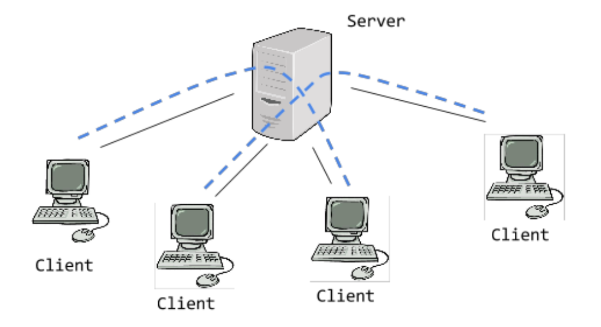
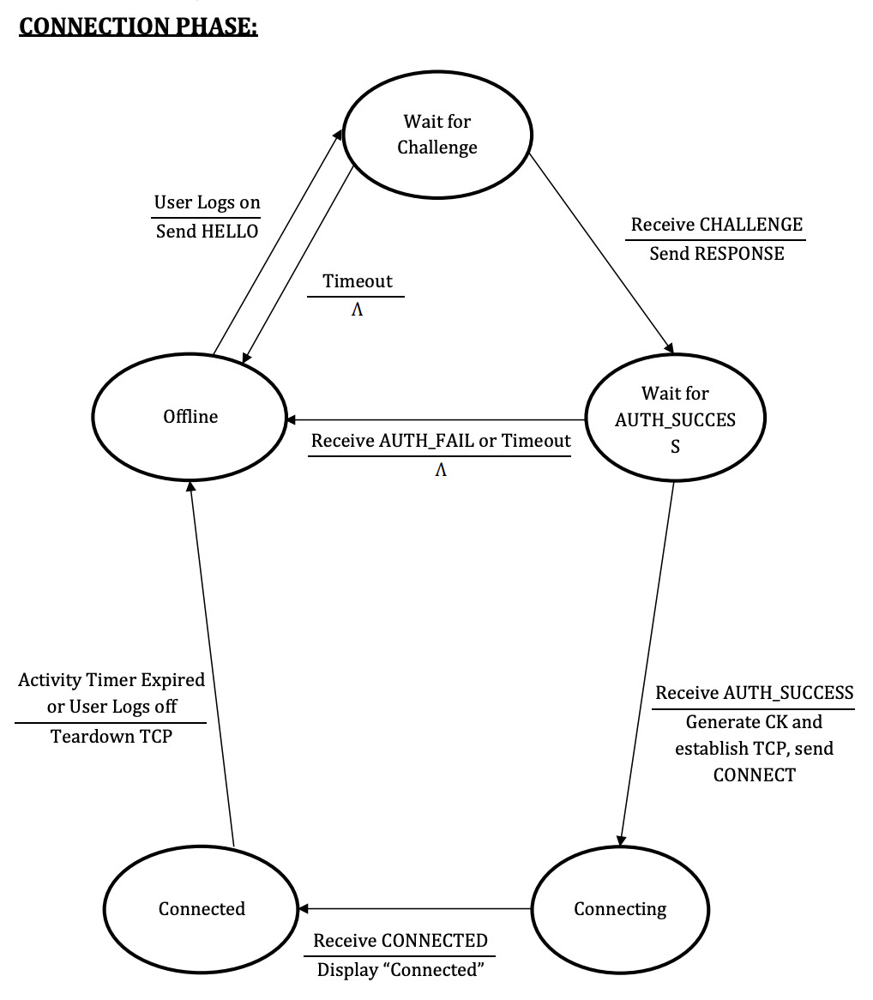
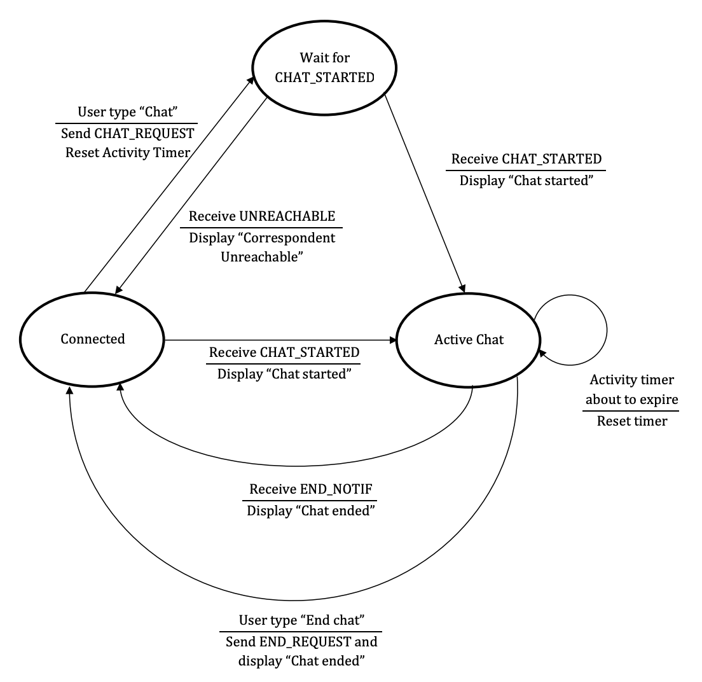
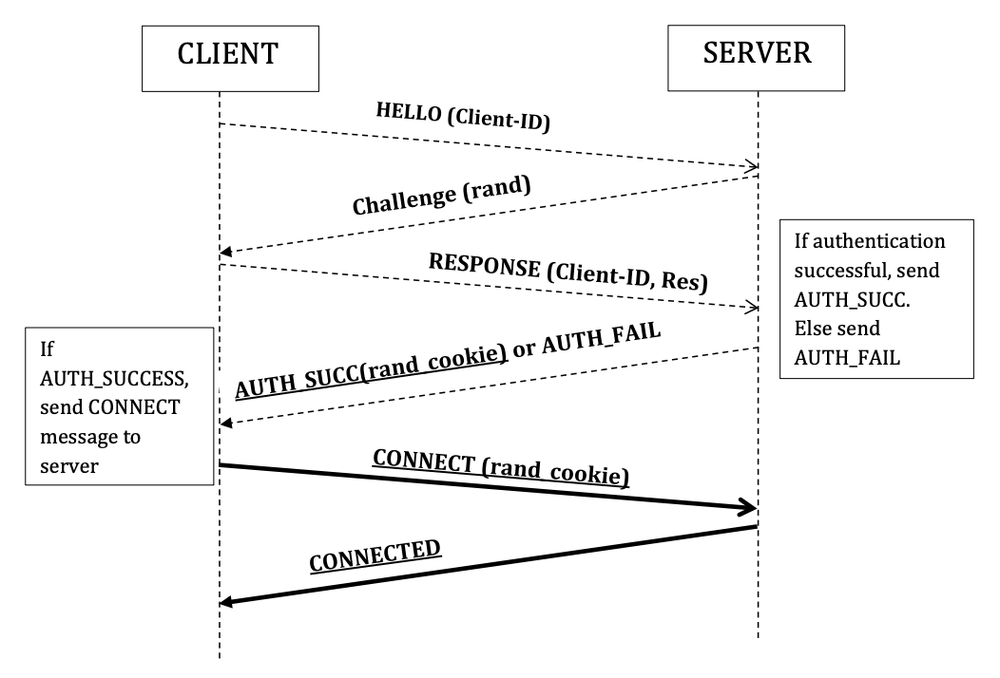

<div id="top"></div>
<!--
*** Thanks for checking out the Best-README-Template. If you have a suggestion
*** that would make this better, please fork the repo and create a pull request
*** or simply open an issue with the tag "enhancement".
*** Don't forget to give the project a star!
*** Thanks again! Now go create something AMAZING! :D
-->


<!-- PROJECT SHIELDS -->
<!--
*** I'm using markdown "reference style" links for readability.
*** Reference links are enclosed in brackets [ ] instead of parentheses ( ).
*** See the bottom of this document for the declaration of the reference variables
*** for contributors-url, forks-url, etc. This is an optional, concise syntax you may use.
*** https://www.markdownguide.org/basic-syntax/#reference-style-links
-->

<!-- PROJECT LOGO -->
<br />
<div align="center">
    
<h3 align="center">Server Based Chat</h3> 
    <p align="center">CS4390 - Computer Networks
    <BR/>
    Group Project
    <br />
  </p>
</div>

<!-- TABLE OF CONTENTS -->
<details>
  <summary>Table of Contents</summary>
  <ol>
    <li>
      <a href="#about-the-project">About The Project</a>
      <ul>
        <li><a href="#to-dos">To Dos</a></li>
        <ul>
            <li><a href="#connection-to-the-server">Connection to the Server</a></li>
            <li><a href="#client-a-initiates-chat-session-to-b">Client A Initiates Chat Session to B</a></li>
            <li><a href="#security">Security</a></li>
            <li><a href="#chat-history">Chat History</a></li>
            <li><a href="#protocol-messages">Protocol Messages</a></li>
            <li><a href="#client-side-state-diagram">Client Side State Diagram</a></li>
        </ul>
        <li><a href="#built-with">Built With</a></li>
      </ul>
    </li>
    <li>
      <a href="#getting-started">Getting Started</a>
      <ul>
        <li><a href="#prerequisites">Prerequisites</a></li>
        <li><a href="#installation">Installation</a></li>
      </ul>
    </li>
    <li><a href="#usage">Usage</a></li>
    <li><a href="#roadmap">Roadmap</a></li>
    <li><a href="#contributing">Contributing</a></li>
    <li><a href="#license">License</a></li>
    <li><a href="#assignment-milestones">Assignment Milestons</a></li>
    <li><a href="#assignnment-grading-criteria">Assignment Grading Criteria</a></li>
    
  </ol>
</details>


<!-- ABOUT THE PROJECT -->
## About The Project

<!--
[![Product Name Screen Shot][product-screenshot]](https://example.com)
-->

In this project, we will design a server and client program for a chat application using Python. 
<div style="padding-left: 30px;">The server will mediate chat sessions between clients.
<br/>
The clients will be limited to 2 per simultaneous chat session.
</br/>
Code will explicitly create sockets, send data and receive data from the sockets. 
</div><br/>


## To Dos

###  <span style="color:#0074CC">Connection to the Server</span>
A client needs to connect first to the server. Connection to the server is initiated when a user logs on.
1. When the user at client A logs on, client A sends a HELLO (Client-ID-A) message to the server, using UDP transport.
2. The server verifies that Client-ID-A is an ID on the list of subscribers. If so, the server retrieves the client’s secret key and sends a CHALLENGE (rand) message to the client, using UDP.
3. The client responds with a RESPONSE (Res) to authenticate itself. If authentication is not successful, the server sends an AUTH_FAIL message to the client. Else the server generates an encryption key CK-A, then sends an AUTH_SUCCESS(rand_cookie, port_number) message to the client. The message is encrypted by CK-A.
4. The client generates the same CK-A key, and decrypts the message. From this point on, all data exchanged between client A and the server is encrypted using CK-A.
5. Client A establishes a TCP connection to the port at port_number and sends a CONNECT (rand_cookie) to the server. From this point on, until the TCP connection is closed, all data (signaling messages and chat) is exchanged over the TCP connection.
6. The server sends CONNECTED to the client. The client is connected.
7. The client tears down the TCP connection when the user types “Log off” or when the activity timer expires.
8. 
###  <span style="color:#0074CC">Client A Initiates Chat Session to B</span>
This scenario will go through the following steps. Client A must have already gone through the
connection phase and be connected to the server.
1. To start a chat with client B, the end user types “Chat Client-ID-B”, and client A sends a
CHAT_REQUEST (Client-ID-B). If the server determines client-B is connected and not
already engaged in another chat session, the server sends CHAT_STARTED(session-ID,
Client-ID-B) to client A, and CHAT_STARTED(session-ID, Client-ID-A) to client B. Client A
and Client B are now engaged in a chat session and can send chat messages with each
other, through the server. The clients display “Chat started” to the end user at A and B. If
client B is not available, the server sends UNREACHABLE (Client-ID-B) to client A.
2. When the end user at A or B wants to terminate the session, the end user types “End
Chat”, and the associated Client sends END_REQUEST (session-ID) to the server.
3. The server sends an END_NOTIF(session-ID) to the other client. The Clients display “Chat
ended” to their respective end users.

###  <span style="color:#0074CC">Security</span>
####  <span style="color:#0074CC">Authentication</span>
The server is assumed secure, and only the client needs to be authenticated. Authentication is
based on the challenge/response mechanism, used in cellular networks.
Upon receiving HELLO (Client-ID-A), the server looks up Client A’s secret key K_A. Then it
generates a random number rand. Rand and K_A are input into an authentication algorithm A3.
The output, XRES, is stored by the server. Then the server sends rand in the CHALLENGE (rand).
Client A is expected to run the same algorithm A3 with the same inputs rand and K_A, and
produce RES, which is sent to the server in the RESPONSE (Res) message. If RES matches XRES,
the server has authenticated the client. For this assignment, use a hash function for algorithm
A3: RES = hash1(rand + K_A), where + denotes concatenation. Examples are MD5, SHA1,
SHA256 etc.
####  <span style="color:#0074CC">Encryption</span>
Concurrently with the above authentication process, the server and client run an A8 algorithm,
which takes as input rand and K_A, to generate a ciphering key CK_A. For this assignment, use a
hash function for A8: CK_A = hash2(rand + K_A).
####  <span style="color:#0074CC">Integrity protection</span>
For simplicity, integrity protection is not implemented.
###  <span style="color:#0074CC">Chat History</span>
In addition, the server will maintain chat history of each client. At any time in the connected
state, client A can see the history of past chat messages with client B by sending the
HISTORY (Client-ID-B) message to the server. In response the server sends all the past chat
messages exchanged between client A and client B. Client A should display all the chat
messages in the history in the following format
<session_id> <from: sending client> <chat message>

###  <span style="color:#0074CC">Protocol Messages</span>
The significant fields of the messages along with their semantics are defined below. As part of
the project assignment, you have to define the precise syntax and format of the messages.
* HELLO (Client-ID-A): Initiates the process for Client A to be authenticated and
registered with the server.
* CHALLENGE (rand): Sent by the server to challenge the client to authenticate itself. rand
is a random number generated by the server. A new rand is generated at every
CHALLENGE.
* RESPONSE (client-ID, Res): Response to the challenge, sent by the client to authenticate
itself.
* AUTH_SUCCESS(rand_cookie, port_number): Sent by the server to notify the client
authentication is successful. rand_cookie is a random number generated by the server,
and port_number is a TCP port number assigned by the server for subsequent
connection by the client.
* AUTH_FAIL: Sent by the server to notify the client authentication has failed
* CONNECT (rand_cookie): Sent by the client to the server. rand_cookie is the cookie
previously sent by the server.
* CONNECTED: Sent by the server to notify the client it has been connected
* CHAT_REQUEST (Client-ID-B): Sent by client A to the server to request a chat session
with Client B
* CHAT_STARTED (session-ID, Client-ID-B): Sent by the server to notify client A that a chat
session with client B has started. Session-ID is an ID assigned to the session
* UNREACHABLE (Client-ID-B): Sent by the server to client A to notify client B is not
available for chat.
* END_REQUEST (session-ID): Sent by any of the clients involved in the chat session to
request a termination of the session
* END_NOTIF (session-ID): Sent by the server to notify a client involved in the session that
the session has been terminated by another client.
* CHAT (session-ID, chat message): Exchanged between the clients, relayed by the server.
Carries the actual chat message
* HISTORY_REQ (Client-ID-B): Sent by client A to request the history of past chat
messages with client B.
* HISTORY_RESP (Sending Client-ID, chat message): Sent by the server to the client who
requested the history. Sending Client-ID is the ID of the client who sent the chat
message, and chat message is the chat message in the history. There is one
HISTORY_RESP message for each chat message in the history.

###  <span style="color:#0074CC">Client Side State Diagram</span>

#### Connection Phase

&nbsp;&nbsp;&nbsp;&nbsp;&nbsp;&nbsp;    

#### Chat Phase

&nbsp;&nbsp;&nbsp;&nbsp;&nbsp;&nbsp;

###  <span style="color:#0074CC">Server Side State Diagram </span>
#### Connection Phase
* Need to do
  
#### Chat Phase
* Need to do

<br/>

### <span style="color:#0074CC">Connection Phases</span>
&nbsp;&nbsp;&nbsp;&nbsp;&nbsp;&nbsp;


###  <span style="color:#0074CC">Validation Scenarios</span>
We will be validating the code based on the following scenarios.
<br/>
### <span style="color:#0074CC">Basic chat initiated and closed by A</span>

| Step | Action | Expected behavior |
|------|--------|-------------------|
|0 | Start from the state where clients A and B are off line|
|1 | Client A’s user types “Log on”| Client A and server should go through the connection phase and exchange the messages shown in “Connection Phase” </br>Client A should display “Connected”|
|2 | Client B’s user types “Log on”| Client B and server should go through the connection phase and exchange the messages shown in “Connection Phase” </br>Client B should display “Connected”| 
|3 | Client A’s user types “Chat Client-ID-B”| Client A should send CHAT_REQUEST, server should send CHAT_STARTED to client B and client A. “Chat started” should be displayed at both clients|
|4 | Client A and client B exchange chat messages | What client　A’s　user　types　should　be　displayed　at client B, and vice versa |
|5 |Client A’s user types “End chat” | Client A should send END_REQUEST to server and display “Chat ended Client B should receive END_NOTIF from server and display “Chat ended”|
|6 |Client A’s user types “Log off"| Client A should close the TCP connection|
<br/>

#### <span style="color:#0074CC">Basic chat initiated by A and closed by B</span>
| Step | Action | Expected behavior |
|------|--------|-------------------|
|0   | Go through steps 0 to 1 of “Basic chat initiated and closed by A”|   |
| 1  | Client A’s user types “Chat Client-ID-B” | Client A should send CHAT_REQUEST, server should reply with UNREACHABLE, client A should display　＜br/> “Correspondent unreachable”  |
|2 |Client B’s user types “Log on” | Client B and server should go through the connection phase and exchange the messages shown in “Connection Phase” <br/>Client B should display “Connected”|
|3| Client A’s user types “Chat Client-ID-B”| Client A should send CHAT_REQUEST, server should send CHAT_STARTED to client B and client A. “Chat started” should be displayed at both clients|
|4 |Client A and client B exchange chat messages | What client A’s user types should be displayed at client B, and vice versa|
|5 | Client B’s user types “End chat” |Client B should send END_REQUEST to server and display “Chat ended”<br/> Client A should receive END_NOTIF from server and display “Chat ended”|
|6| Client A’s user types “Log　off"| Client A should close the TCP connection|

</br>

#### <span style="color:#0074CC">Basic chat initiated by C, but B is already in another chat</span>

|Step |Action |Expected behavior|
|-|-|-|
|0| Go through steps 0 to 4 of “Basic chat initiated and closed by A”||
|1| Client C’s user types “Log on” | Client C and server should go through the connection phase and exchange the messages shown in “Connection Phase” </br> Client C should display “Connected”|
|2| Client C’s user types “Chat Client-ID-B” | Client C should send CHAT_REQUEST, server should reply with UNREACHABLE, client C should display “Correspondent unreachable” |

</br>

#### <span style="color:#0074CC">History recall</span>
|Step |Action |Expected behavior|
|-|-|-|
|0| Go through the steps of| “Basic chat initiated and closed by A” |
|1 | Client B’s user types “Log on" | Client B and server should go through the connection phase and exchange the messages shown in “Connection Phase” <br/> Client B should display “Connected”|
|2 |Client A’s user types “History Client-ID-B”| Client A should send HISTORY_REQ and should receive all the chat messages of the last chat session with B, sent in one or more HISTORY_RESP messages|

<br/>

#### <span style="color:#0074CC">Simultaneous chat sessions</span>
Verify you can establish 5 simultaneous chat sessions between 5 pairs of clients.


<br/>

## Built With

* [Python.js](https://www.python.org//)
<p align="right">(<a href="#top">back to top</a>)</p>


<!-- GETTING STARTED -->
## Getting Started
?

### <span style="color:#0074CC">Prerequisites</span>
 
EX:
* npm 
  ```sh
  npm install npm@latest -g
  ``` 
  
### <span style="color:#0074CC">Installation</span>
EX: 

1. Clone the repo
   ```sh
   git clone https://github.com/github_username/repo_name.git
   ```
2. Install NPM packages
   ```sh
   npm install
   ```
3. Connect to the server
  * Use provided server address

<p align="right">(<a href="#top">back to top</a>)</p>

<!-- USAGE EXAMPLES -->
## Usage

Use this space to show useful examples of how to use the application. 
- Additional screenshots
- Code examples
- Demos
- Links to more resources.

<p align="right">(<a href="#top">back to top</a>)</p>


<!-- ROADMAP -->
## Roadmap

- [ ] Feature 1
<!-- 
- [ ] Feature 2
- [ ] Feature 3
    - [ ] Nested Feature
    - [ ] 
See the [open issues](https://github.com/github_username/repo_name/issues) for a full list of proposed features (and known issues). 
-->
<p align="right">(<a href="#top">back to top</a>)</p>


<!-- CONTRIBUTORS -->
## Contributors
<br/>
<div align="center">


|||||
| -------   | ------------- |------------- | -----|
| [@Your_Name](https://twitter.com/kantancoder)  | [@Your_Name](https://twitter.com/Your_Name)  | [@Your_Name](https://twitter.com/Your_Name) |  [@Your_Name](https://twitter.com/Your_Name) | 
| email@email_client.com | email@email_client.com | email@email_client.com | email@email_client.com |
|[![LinkedIn][linkedin-shield]][linkedin1-url]|[![LinkedIn][linkedin-shield]][linkedin2-url]|[![LinkedIn][linkedin-shield]][linkedin3-url]|[![LinkedIn][linkedin-shield]][linkedin4-url]|

</div>

<p align="right">(<a href="#top">back to top</a>)</p>


<!-- LICENSE -->
## License

<!-- Distributed under the MIT License. See `LICENSE.txt` for more information. -->

<p align="right">(<a href="#top">back to top</a>)</p>


<br/>

## Assignment Milestones
### <span style="color:#0074CC">What to Turn In</span>
1. A proposed action plan by the due date specified in “ProjectTimeline” in “Projects
Overview”.
2. A team report by by the due date specified in “ProjectTimeline” in “Projects Overview”.
a) Containing source codes related to client and server. Include a README file that
describes how to compile/run the program.
b) Providing a background summary of challenge/response authentication scheme
c) Describing your hardware setup and configuration
d) Including the design document of your code (e.g. Protocol State Diagrams, Sequence
Diagram or any other info that helps to understand what has been done)
e) Providing screenshots of chat sessions
f) Describing what issues, if any, the team encountered during the project, how the team
overcame the issues and what the team learned from the project. You can also provide
suggestions on how the projects in Computer Networks could be improved in the
future.
g) Including a video clip to demo the code running
3. Individual reports, one for each team member by the due date specified in “ProjectTimeline
in “Projects Overview””. The individual report is confidential and not shared with the other
team members.
a) If you, as an individual team member, have anything specific to add to 1.f) in the team
report, please do it in your individual report. Describe what issues, if any, you, as an
individual team member, encountered during the project, how you overcame the
issues and what you learned from the project (this is not necessarily just about the
topic, could be related to teamwork, etc.). You can also provide suggestions on how the
projects in Computer Networks could be improved in the future. This complements the
team report with any individual viewpoint not included in the team report.
b) Describing what each team member (including yourself) did and contributed to the
project, and assign a numerical score from 1 to 10 to each team member, including
yourself. 1 is the poorest, and 10 is the best.
Note: There will be a separate session (taking place outside of lecture hours) for you to demo
your code is running and answer questions about your code and design. The code demo
sessions will take place towards the end of the semester

 Note: There will be a separate session (taking place outside of lecture hours) for you to demo your code is running and answer questions about your code and design. The code demo sessions will take place towards the end of the semester.

<p align="right">(<a href="#top">back to top</a>)</p>

<br/>

## Assignnment Grading Criteria

General Note: The following are criteria used to come up with a team grade. Your final
individual project score is not necessarily the team grade, it may be flexed up or down,
depending on your individual contribution to the team and the quality of your individual report.
### <span style="color:#0074CC">Coding (60%)</span>
Source code of your well-structured and well-documented program. Include comments
on your codes for clarification. In addition, your project has to meet the validation
scenarios. Generally, “connection phase” weigh 25% and “chat phase” weigh 35%. You
should be able to demonstrate good understanding of the code and be able to
answer specific questions on the code and design.
### <span style="color:#0074CC">Documents (40%)</span>
Group Report (40%): The group report will be evaluated not only on its content, but also
the professionalism of its appearance. 

<p align="right">(<a href="#top">back to top</a>)</p>


<!-- MARKDOWN LINKS & IMAGES -->
<!-- https://www.markdownguide.org/basic-syntax/#reference-style-links -->
[contributors-shield]: https://img.shields.io/github/contributors/github_username/repo_name.svg?style=for-the-badge
[contributor1-url]:https://github.com/rgonzalez214
[contributor2-url]:https://github.com/username
[contributor3-url]:https://github.com/username
[contributor3-url]:https://github.com/username
<!-- 
[forks-shield]: https://img.shields.io/github/forks/github_username/repo_name.svg?style=for-the-badge
[forks-url]: https://github.com/github_username/repo_name/network/members
[stars-shield]: https://img.shields.io/github/stars/github_username/repo_name.svg?style=for-the-badge
[stars-url]: https://github.com/github_username/repo_name/stargazers
[issues-shield]: https://img.shields.io/github/issues/github_username/repo_name.svg?style=for-the-badge
[issues-url]: https://github.com/github_username/repo_name/issues
[license-shield]: https://img.shields.io/github/license/github_username/repo_name.svg?style=for-the-badge
[license-url]: https://github.com/github_username/repo_name/blob/master/LICENSE.txt
-->
[linkedin-shield]: https://img.shields.io/badge/-LinkedIn-black.svg?style=for-the-badge&logo=linkedin&colorB=555
[linkedin1-url]: https://linkedin.com/in/linkedin_username
[linkedin2-url]: https://linkedin.com/in/linkedin_username
[linkedin3-url]: https://linkedin.com/in/linkedin_username
[linkedin3-url]: https://linkedin.com/in/linkedin_username
[linkedin4-url]: https://linkedin.com/in/linkedin_username
[product-screenshot]: images/screenshot.png


